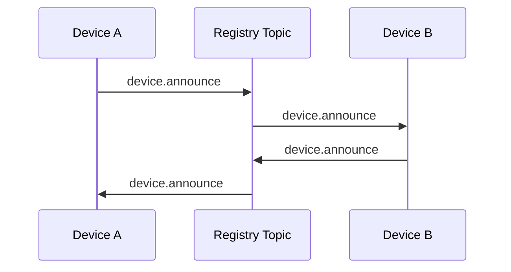
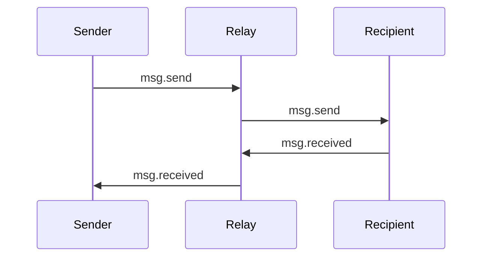
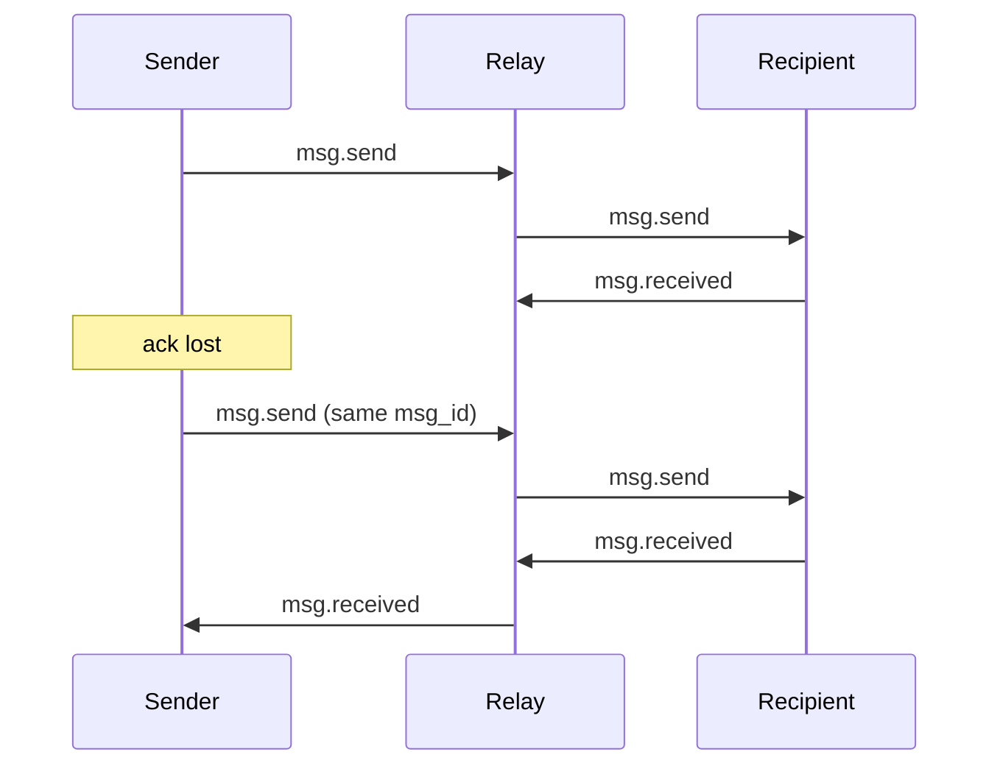

# LinkHop Lite Protocol (Draft)

## Overview

LinkHop Lite is a device-to-device messaging protocol built on top of ntfy-style topic relay.

Design goals:
- browser-first implementation with no backend besides ntfy
- local-first state using browser storage
- direct device-to-device messaging
- explicit acknowledgement of receipt
- minimal core protocol
- simulation and testing before full implementation

LinkHop Lite assumes that most devices reconnect within the relay retention window. Stronger guarantees are defined as optional extensions.

## Terminology

- **network**: a logical LinkHop group derived from shared membership material
- **network_id**: a stable opaque identifier for a LinkHop network
- **registry topic**: shared topic for device discovery and metadata events
- **device topic**: unique topic for direct delivery to one device
- **device_id**: stable device identity
- **device_name**: mutable user-visible device label
- **event_id**: unique identifier for one wire event
- **msg_id**: stable identifier for one logical message
- **received**: durable local inbox storage on the recipient device

## Transport Model

The protocol assumes an ntfy-style relay that:
- accepts messages on topics
- delivers them to subscribers
- retains messages for a limited time

There are two topic types:

### Registry topic
A shared topic used for:
- device discovery
- device metadata refresh
- explicit leave events

### Device topic
A unique topic per device used for:
- direct message delivery
- delivery acknowledgements

## Core Protocol

## Auth

### Network membership

A LinkHop network is defined by a shared password.

All devices in the same network are configured with that password.

In the current core design, the shared password is used to derive network membership material, including a stable network identifier / topic namespace for that password.

This means:
- devices with the same password derive the same network namespace
- devices with different passwords are on different logical LinkHop networks
- changing the password creates a new logical network in core

The password is part of the core design because it determines network membership. It is expected to support both:
- topic derivation and/or topic access control
- future authenticity / cryptographic checks

The exact cryptographic use of the password is deferred.

### Scope

Core auth applies to:
- participation in the registry topic
- publishing and receiving device/message protocol events

Local app auth is out of scope.

## Devices

### Identity

Each device has:
- `device_id`: immutable, globally unique within practical use
- `device_name`: mutable, user-visible

`device_name` may be changed by that device at any time.

### Device events

#### `device.announce`
Emitted:
- on startup
- on reconnect
- whenever the device wants to refresh its metadata

Published to:
- registry topic

Purpose:
- announce presence
- publish current device metadata
- refresh a renamed device

Suggested payload fields:
- `device_id`
- `device_name`
- `device_topic`
- `protocol_version`

#### `device.leave`
Emitted:
- only when the device user explicitly leaves/removes the device

Published to:
- registry topic

Purpose:
- explicit removal from the network

### Presence and device freshness

Devices emit periodic `device.heartbeat` events (recommended: once per hour) to the registry topic so peers can track liveness.

A local device record keeps:
- `last_event_at`
- `last_event_type`

The UI displays a "last seen" time derived from `last_event_at` (e.g. "seen 2h ago").

#### `device.heartbeat`

Emitted:
- periodically while connected (recommended: once per hour)

Published to:
- registry topic

Purpose:
- periodic liveness signal
- enables "last seen" tracking

Payload fields:
- `device_id`

Processing rules:
- Updates `last_event_at` and `last_event_type` on known, non-removed devices
- Does not create records for unknown devices
- Does not revive removed devices
- Not recorded in the persistent event log

### Peer-to-peer device sync

When a device connects and cannot discover all peers via retained announcements (e.g. after a long offline period beyond relay retention), it can request the full device list from a known peer.

#### `sync.request`

Emitted:
- on first connection, after a short delay to allow initial SSE events to arrive

Published to:
- target peer's device topic

Purpose:
- request the full known device list from a peer

Payload fields:
- `to_device_id`

#### `sync.response`

Emitted:
- in response to a `sync.request` addressed to this device

Published to:
- requester's device topic

Purpose:
- send the full known device list to the requester

Payload fields:
- `to_device_id`
- `devices` (array of DeviceRecord, excluding removed devices)

Processing rules:
- Merges devices into local state
- Only updates existing devices if peer has newer `last_event_at`
- Does not overwrite with older data

### Device discovery

Devices discover each other through the registry topic.



Each device maintains a local cache of known devices derived from registry events.

## Messages

### Message event types

The core protocol defines two message events:
- `msg.send`
- `msg.received`

### Message identifiers

Each logical message has:
- `msg_id`: stable across the life of the logical message
- `attempt_id`: starts at `1`; may be incremented by retry extensions later

Including `attempt_id` from the beginning avoids reshaping later even if retry is optional.

### `msg.send`

Emitted by:
- sender device

Published to:
- recipient device topic

Purpose:
- deliver a message from one device to another

Suggested payload fields:
- `msg_id`
- `attempt_id`
- `to_device_id`
- `body`

### `msg.received`

Emitted by:
- recipient device

Published to:
- sender device topic

Purpose:
- acknowledge successful receipt

Suggested payload fields:
- `msg_id`
- `to_device_id`

### Receipt semantics

A message is considered **received** when the recipient has durably stored it in local state such that it will appear in that device’s inbox after restart.

`msg.received` means:
- the recipient device accepted the message
- the recipient device stored it durably

`msg.received` does **not** mean:
- the user saw the message
- the user read the message
- the recipient replied

### Basic delivery flow



Rules:
- sender keeps a local pending record until the first matching `msg.received`
- recipient must persist the message before emitting `msg.received`

### Deduplication

Recipient devices deduplicate by `msg_id`.

If the same `msg_id` arrives again:
- do not create a second inbox entry
- emit `msg.received` again

This handles lost acknowledgements cleanly.

### Lost acknowledgement case



### Scope limitations

Core protocol does not guarantee:
- delivery beyond relay retention
- message ordering
- read/view/delete sync
- long-offline recovery

## Browser Implementation Model

The primary implementation target is a browser app with no backend besides ntfy.

The browser app is responsible for:
- subscribing to registry and device topics
- publishing protocol events to ntfy
- maintaining local state in browser storage
- deriving inbox, pending, and known-device views from local state

The browser app should separate:
- transport concerns
- protocol state transitions
- local persistence
- UI rendering

## Local State Model

Local state is intentionally separate from wire events.

Wire events are:
- append-only
- transport-oriented
- topic-delivered

Local records are:
- derived from events
- query-oriented
- optimized for app behavior

Suggested local stores:
- `devices`
- `messages`
- optionally `events` for debugging

### Device record

Suggested fields:
- `device_id`
- `device_name`
- `device_topic`
- `last_event_at`
- `last_event_type`
- local derived status if useful

### Message record

Suggested fields:
- `msg_id`
- `from_device_id`
- `to_device_id`
- `body`
- `created_at`
- `state` (`pending`, `received`, possibly later `expired`)
- `last_attempt_id`
- `last_attempt_at`
- `received_at`

### Event log record (optional)

A rolling local event log is useful in development for debugging:
- raw incoming events
- raw outgoing events
- dedupe decisions
- state transitions

## Subscription Model

Each client:
- MUST subscribe to the registry topic for its current network
- MUST subscribe to its own device topic
- MUST NOT rely on subscribing to peer device topics for normal operation

For the browser implementation, SSE is the preferred browser-to-relay subscription mechanism if supported cleanly by ntfy, because it matches the append-only event flow and keeps the transport simple.

This is about browser-to-relay subscription only. The protocol does not define a separate app backend or local HTTP event stream.

## Reference Client for Testing

A minimal non-browser reference client is in scope for testing and validation.

This client is **not** a backend. It is a second client implementation of the same protocol.

Purpose:
- manual protocol testing
- automated simulation and replay
- verifying that the protocol is not browser-specific

The reference client should remain small and headless, with a thin CLI only.

### Reference client responsibilities

- subscribe to registry and device topics
- publish protocol events
- persist local state
- inspect local state
- export or replay test fixtures

### CLI scope

Useful commands may include:
- `init`
- `whoami`
- `announce`
- `leave`
- `devices`
- `send`
- `inbox`
- `pending`
- `watch`
- `events --json`
- `export-state`
- `replay`

Out of scope:
- TUI
- local HTTP server
- rich end-user terminal UX

## Simulation and Testing

The protocol should be testable without any dedicated backend.

Recommended testing layers:

### 1. Pure state-machine tests

Test protocol logic with:
- local actions
- incoming events
- deterministic time

No browser, no ntfy, no persistent storage required.

### 2. In-memory relay simulation

Use a fake relay with:
- topics
- subscriptions
- delayed delivery
- dropped events
- duplicate delivery
- retention windows

This is the main tool for automated multi-device testing.

### 3. Real integration testing

Use:
- real ntfy topics
- browser app instances
- reference CLI client

This validates the actual end-to-end environment.

### Recommended first scenarios

- device announce creates/updates known device record
- sender sends a message; recipient stores it; recipient emits `msg.received`
- duplicate `msg.send` does not create duplicate inbox entries
- lost acknowledgement leaves sender pending until another `msg.received` arrives
- recipient offline within retention still receives message after reconnect
- recipient offline beyond retention misses message in core protocol

## Extensions

## Retry / Keepalive / Offline Recovery

Offline recovery is an extension only.

The core protocol assumes relay retention is enough for typical short offline gaps.

Optional retry behavior may later allow:
- sender-only retries
- resending every few hours
- expiry after a larger time window such as 7 days

This remains out of core because it increases protocol traffic and complexity.

## Encryption

Encryption is deferred.

Future work may define:
- payload confidentiality
- authenticity and signing
- device key management
- password-derived key material

## Password Rotation (Possible Future Extension)

Password rotation is not part of the current core design.

In core, changing the shared password creates a new logical network and therefore a new topic namespace.

A later extension may support password rotation without changing the logical network identity. That would likely require:
- a stable network identity separate from the password-derived namespace
- a transition mechanism from old password to new password
- rules for offline devices during rotation
- overlap / expiry rules for old and new membership material

This is intentionally deferred because it adds coordination complexity and is not needed for the first implementation.

## JSON Shapes

This section defines suggested JSON shapes for:
- protocol events sent over ntfy topics
- local records stored by browser and reference clients

These shapes are intentionally small and explicit.

### Design principles

- Wire events and local records are different things.
- Wire events are append-only transport messages.
- Local records are derived state optimized for querying and rendering.
- Event type is explicit in the envelope; lifecycle is not represented as a generic status field.
- Timestamps use ISO-8601 UTC strings.

## Protocol Event Envelope

All protocol events published to ntfy topics should share a common outer structure.

```json
{
  "type": "msg.send",
  "timestamp": "2026-04-04T18:40:00Z",
  "network_id": "net_f7k29m",
  "event_id": "evt_01",
  "from_device_id": "dev_phone_123",
  "payload": {}
}
```

### Envelope fields

- `type`: protocol event type
- `timestamp`: event creation time in UTC
- `network_id`: stable opaque network identifier derived from the shared password or associated membership material
- `event_id`: unique identifier for this wire event
- `from_device_id`: device that emitted the event
- `payload`: event-specific object

### Notes

- `event_id` exists for wire-event identity, debugging, and optional event-log dedupe.
- `msg_id` is separate from `event_id` and belongs inside message payloads.
- `network_id` should appear in the event body even if it is also implicit in topic naming, because it improves debugging and fixture clarity.

## Core Protocol Events

### `device.announce`

Published to:
- registry topic

Purpose:
- announce device presence
- publish or refresh current device metadata

```json
{
  "type": "device.announce",
  "timestamp": "2026-04-04T18:30:00Z",
  "network_id": "net_f7k29m",
  "event_id": "evt_announce_001",
  "from_device_id": "dev_phone_123",
  "payload": {
    "device_id": "dev_phone_123",
    "device_name": "Jono Phone",
    "device_topic": "linkhop.test.net_f7k29m.device.dev_phone_123",
    "protocol_version": "lite-v1"
  }
}
```

#### `device.announce` payload fields

- `device_id`: stable device identifier
- `device_name`: current mutable display name
- `device_topic`: direct-delivery topic for that device
- `protocol_version`: current protocol version string

### `device.leave`

Published to:
- registry topic

Purpose:
- explicit device removal by user action

```json
{
  "type": "device.leave",
  "timestamp": "2026-04-04T18:35:00Z",
  "network_id": "net_f7k29m",
  "event_id": "evt_leave_001",
  "from_device_id": "dev_phone_123",
  "payload": {
    "device_id": "dev_phone_123"
  }
}
```

#### `device.leave` payload fields

- `device_id`: stable device identifier

### `msg.send`

Published to:
- recipient device topic

Purpose:
- deliver one logical message from sender device to recipient device

```json
{
  "type": "msg.send",
  "timestamp": "2026-04-04T18:40:00Z",
  "network_id": "net_f7k29m",
  "event_id": "evt_send_001",
  "from_device_id": "dev_phone_123",
  "payload": {
    "msg_id": "msg_001",
    "attempt_id": 1,
    "to_device_id": "dev_desktop_456",
    "body": {
      "kind": "text",
      "text": "hello from phone"
    }
  }
}
```

#### `msg.send` payload fields

- `msg_id`: stable logical message identifier
- `attempt_id`: send attempt number, beginning at `1`
- `to_device_id`: intended recipient device
- `body`: opaque or typed message body

#### Message body

For now, the simplest useful body is:

```json
{
  "kind": "text",
  "text": "hello from phone"
}
```

This leaves room for future message kinds without changing the outer message shape.

### `msg.received`

Published to:
- sender device topic

Purpose:
- acknowledge durable receipt of a message

```json
{
  "type": "msg.received",
  "timestamp": "2026-04-04T18:40:03Z",
  "network_id": "net_f7k29m",
  "event_id": "evt_recv_001",
  "from_device_id": "dev_desktop_456",
  "payload": {
    "msg_id": "msg_001",
    "to_device_id": "dev_phone_123"
  }
}
```

#### `msg.received` payload fields

- `msg_id`: logical message identifier being acknowledged
- `to_device_id`: original sender device

## Topic Naming and URL Conventions

Suggested topic naming convention:

```text
registry topic: linkhop.<env>.<network_id>.registry
device topic:   linkhop.<env>.<network_id>.device.<device_id>
```

Example topics:

```text
linkhop.test.net_f7k29m.registry
linkhop.test.net_f7k29m.device.dev_phone_123
linkhop.test.net_f7k29m.device.dev_desktop_456
```

Example self-hosted ntfy URLs:

```text
http://localhost:8080/linkhop.test.net_f7k29m.registry
http://localhost:8080/linkhop.test.net_f7k29m.registry/sse
http://localhost:8080/linkhop.test.net_f7k29m.device.dev_phone_123
http://localhost:8080/linkhop.test.net_f7k29m.device.dev_phone_123/sse
```

## Local Record Shapes

Local records are not wire events. They are derived state persisted in browser storage or the reference client’s local store.

### Device record

Suggested shape:

```json
{
  "device_id": "dev_desktop_456",
  "device_name": "Office Desktop",
  "device_topic": "linkhop.test.net_f7k29m.device.dev_desktop_456",
  "last_event_at": "2026-04-04T17:10:00Z",
  "last_event_type": "device.announce",
  "is_removed": false
}
```

#### Device record notes

- Derived from registry events and optionally message events.
- `is_removed` is local derived state based on `device.leave`.
- More derived status can be added later, but should not be treated as protocol truth.

### Message record

Suggested shape:

```json
{
  "msg_id": "msg_001",
  "from_device_id": "dev_phone_123",
  "to_device_id": "dev_desktop_456",
  "body": {
    "kind": "text",
    "text": "hello from phone"
  },
  "created_at": "2026-04-04T18:40:00Z",
  "state": "pending",
  "last_attempt_id": 1,
  "last_attempt_at": "2026-04-04T18:40:00Z",
  "received_at": null
}
```

#### Message record notes

- Represents one logical message.
- `state` is local derived state, not a wire event type.
- Suggested initial states are `pending` and `received`.
- A later retry extension may add `expired`.

### Event log record (optional)

Suggested dev/debug shape:

```json
{
  "event_id": "evt_send_001",
  "type": "msg.send",
  "timestamp": "2026-04-04T18:40:00Z",
  "from_device_id": "dev_phone_123",
  "raw_event": {
    "type": "msg.send"
  }
}
```

A rolling local event log is helpful for:
- debugging
- replay
- simulation fixture export
- comparing browser and reference-client behavior

## Validation and Event Rejection

Clients SHOULD ignore malformed or irrelevant events rather than failing globally.

A client SHOULD reject or ignore events when:
- `network_id` does not match the current network
- required fields are missing
- `type` is unknown
- `to_device_id` does not match the local device for direct message handling
- payload shape does not match the declared event type

Clients MAY keep rejected events in a local debug log for troubleshooting.

## Normative Core Behavior

### Device handling

- A client MUST subscribe to the registry topic for its current network.
- A client MUST subscribe to its own device topic.
- A client SHOULD emit `device.announce` on startup and reconnect.
- A client MAY emit `device.announce` when its device metadata changes.
- A client MUST treat `device_name` as mutable.
- A client MUST treat `device_id` as stable identity.

### Send handling

- When sending a message, the sender MUST create a new `msg_id`.
- The initial `attempt_id` MUST be `1`.
- The sender MUST publish `msg.send` to the recipient device topic.
- The sender MUST store the logical message locally as pending until a matching `msg.received` is processed or the message is otherwise cleared by a future extension.

### Receive handling

- On receiving `msg.send`, the recipient MUST ignore the event if `to_device_id` does not match the local device.
- On receiving a new `msg.send`, the recipient MUST durably store the logical message before emitting `msg.received`.
- `msg.received` MUST only be emitted by the intended recipient device.
- `msg.received` MUST be sent to the original sender device topic.

### Deduplication

- A recipient MUST deduplicate messages by `msg_id`.
- Duplicate `msg.send` events with the same `msg_id` MUST NOT create duplicate inbox entries.
- On duplicate `msg.send`, the recipient SHOULD emit `msg.received` again.

### Acknowledgement handling

- A sender MUST clear the pending state for a message after the first valid matching `msg.received`.
- `msg.received` indicates durable local inbox storage only.
- `msg.received` MUST NOT be interpreted as a read/view/delete signal.

## First Implementation Defaults

These are implementation defaults, not protocol requirements:
- browser local storage: IndexedDB
- browser subscription transport: ntfy SSE if practical
- reference non-browser client: minimal headless CLI
- topic naming convention: `linkhop.<env>.<network_id>.registry` and `linkhop.<env>.<network_id>.device.<device_id>`
- initial `attempt_id`: `1`

## Reference CLI Command Semantics

The reference CLI exists for testing and validation, not as a first-class product UI.

Suggested command semantics:

- `init`: create or load local device identity and network configuration
- `whoami`: print local device identity and topic information
- `announce`: emit `device.announce`
- `leave`: emit `device.leave`
- `devices`: display locally known devices
- `send <device-id> <text>`: create local pending message and emit `msg.send`
- `inbox`: display locally stored received messages
- `pending`: display locally pending outbound messages
- `watch`: subscribe and continuously display raw events and/or state transitions
- `events --json`: print recent local event log
- `export-state`: export local state snapshot
- `replay <file>`: replay a fixture or event log into the local engine

## Simulation Fixture Format

A simulation fixture may contain:
- initial local state
- a timeline of local actions
- a timeline of incoming protocol events
- expected resulting local state

Suggested high-level shape:

```json
{
  "name": "lost-ack-basic",
  "initial_state": {},
  "steps": [
    {
      "at": "2026-04-04T18:40:00Z",
      "kind": "incoming_event",
      "event": {
        "type": "msg.send"
      }
    }
  ],
  "expected": {}
}
```

The exact fixture schema can be refined once the reducer / state-machine interface is defined.

## Out of Scope for Core

The following are explicitly out of scope for the current core protocol:
- message ordering guarantees
- archive nodes
- long-offline recovery beyond relay retention
- encryption details
- read/view/delete synchronization
- password rotation within the same logical network
- backend APIs
- TUI support
- protocol version compatibility guarantees before first implementation

## Future Questions

These questions are intentionally left open for later revisions:
- whether capability advertisement belongs in `device.announce`
- how password-derived auth should be formalized
- how retry settings should be represented if the retry extension is implemented
- whether password rotation should be supported without creating a new network namespace
